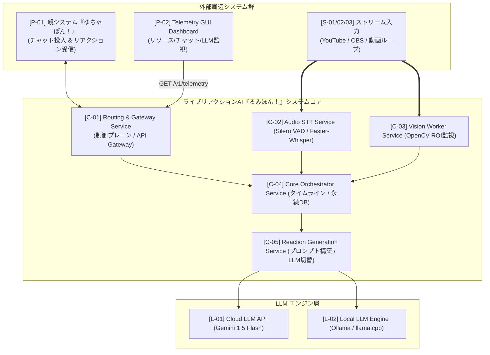

# 🎀 るみぽん！ (Lumi / Rumipon)
> **ライブ配信リアルタイムマルチモーダル理解 ＆ リアクション生成AIエンジン**
>
> **Lumi** = **L**ive **U**nderstanding & **M**ultimodal **I**nteractivity Companion

> ⚠️ **現在の開発ステータス (Development Status)**
>
> 😜 **テヘペロ！** 
> まだプロジェクトリポジトリを作成したばかりで、現在は**爆速で練り上げた超完璧な「システム詳細設計書」のみ**が鎮座しています！
> 実装コード（`services/` のコンテナ群）はこれから絶賛構築中ですので、温かい目で見守っていただけると嬉しいです！✨

---

## 🎀 システム概要


**「るみぽん！」(Lumi / Rumipon)** は、YouTube等のライブ配信（映像・音声・チャット）をリアルタイムで理解し、配信の流れや空気感に合わせた自然なリアクションテキストを自動生成するマルチモーダルAIエージェントシステムです。

本システムは、YouTubeライブ接続＆チャット読み上げを行う親システム**「ゆちゃぽん！」([tk44fk40/youtube_tts](https://github.com/tk44fk40/youtube_tts))** とプラグイン連携する姉妹システムとして動作します。

```
 🎤 親システム: 『ゆちゃぽん！』 (tk44fk40/youtube_tts)
    └─ YouTubeチャットを取得 ＆ VOICEVOXで音声読み上げ
       ▲
       │ プラグイン接続 (チャット投入 ⇔ リアクション返却)
       ▼
 👀 姉妹システム: 『るみぽん！』 (tk44fk40/lumi_companion)
    └─ 映像・音声ストリームをリアルタイム理解 ＆ AIリアクション生成
```

---

## ✨ 主な特徴 (Features)

* **👀 リアルタイムマルチモーダル理解**:
  * **視覚 (Vision)**: 720p/1fps OpenCV ROI差分監視 ＆ 画面変化テキスト化
  * **聴覚 (Audio)**: Silero VAD (発声検知) ＋ Faster-Whisper (文字起こし) ＋ 音響SE検出 (爆発/銃声/叫び)
  * **文脈 (Context)**: チャットタイムシフト同期 ＋ SQLite (WALモード) による永続化ローリング要約
* **⚡️ 超低レイテンシ設計 (2〜4秒)**:
  * 最新1コマ保持 Queue (`maxsize=1`) ＋ 2段階解像度最適化 (前処理720p ➔ メインLLM投入時480p圧縮) によりレスポンス最速化。
* **🐳 ポータブル・マルチコンテナ構成**:
  * Podman (Rootless) / Docker Desktop (WSL2) 完全対応。
  * デバイス・NVIDIA CUDAと直結するワーカー層には **Distrobox** を柔軟採用。
* **🛠 制御 / データプレーン分離 ＆ 堅牢メカニズム**:
  * 大容量ストリームはワーカーへ直引き受領。API Gateway、サーキットブレイカー、定期ポーリングAPI (`GET /v1/telemetry`) を標準装備。
* **🎬 【将来像】動画編集ソフト (DaVinci Resolve) 連携**:
  * 録画・動画ファイルから見どころ・会話を解析し、DaVinci Resolve用タイムラインマーカー (`markers.csv`) ＆ 字幕 (`.srt`) を自動出力。

---

## 🏗 アーキテクチャ図 (Architecture)



---

## 🚀 クイックスタート (Quick Start)

### 前提条件
* Linux (Podman / Distrobox) または Windows (Docker Desktop / WSL2)
* NVIDIA GPU (RTX 2070 8GB VRAM 以上推奨)
* Gemini API Key

### 起動手順

```bash
# リポジトリのクローン
git clone https://github.com/tk44fk40/lumi_companion.git
cd lumi_companion

# 環境変数の設定
export GEMINI_API_KEY="your_api_key_here"

# コンテナの起動 (Podman or Docker)
podman-compose up -d
# または
docker compose up -d
```

---

## 📖 ドキュメント (Documentation)

詳細なアーキテクチャ設計・インターフェース仕様・データフローについては以下をご参照ください。

* 📄 [システム詳細設計書](./docs/DESIGN_SPEC.md)


---

## 📄 ライセンス (License)

This project is licensed under the Apache License 2.0 - see the [LICENSE](./LICENSE) file for details.

