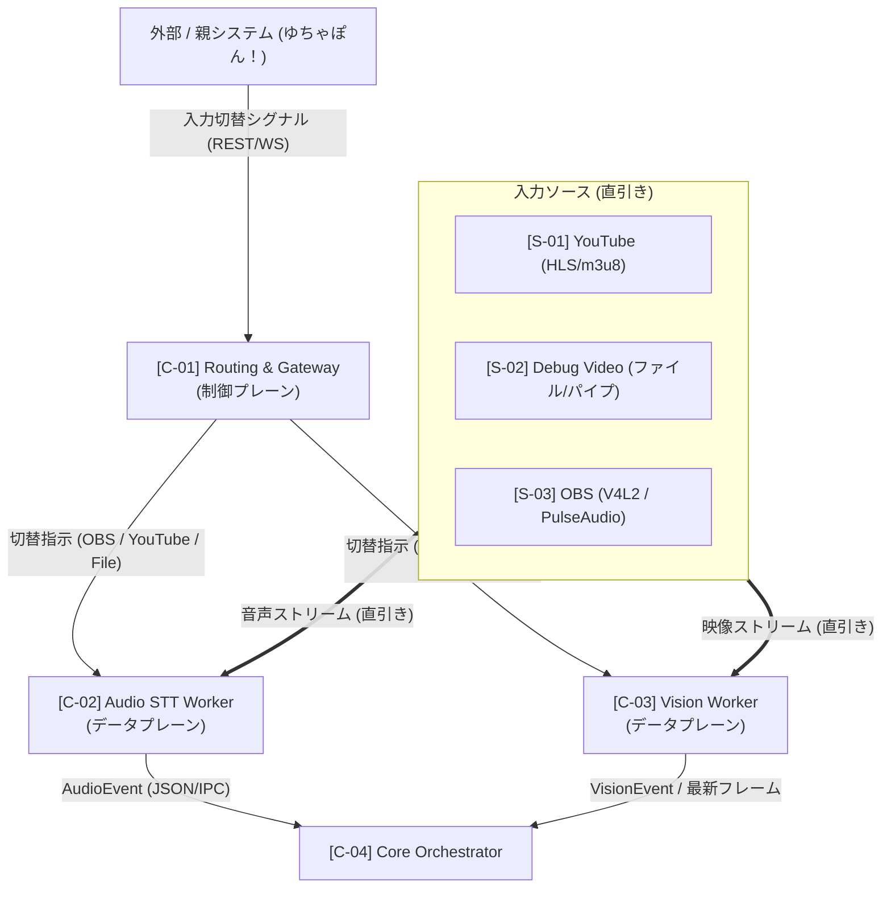

# 音声処理ストリーム連携構想 ＆ 音声認識・ノイズ除去ライブラリ要件仕様書

本ドキュメントは、**「るみぽん！」(Lumi Companion)** における映像・音声ストリーム切り替え構想の要約と、`[C-02] Audio Worker` 向けに独立実装・導入を検討している **「音声認識・ノイズ除去 Python ライブラリ」** の技術要件をまとめた仕様書です。

---

## 1. ストリーム連携構想の簡潔なまとめ

将来のコンポーネント化（Phase 2/3）では、CPU/GPU負荷と通信帯域を最小化するため、**「制御プレーンとデータプレーンの分離」** および **「ストリーム直引きアーキテクチャ」** を採用します。



### 連携の仕組み
1. **制御プレーン (`[C-01]`)**:
   * 外部からの「OBS/YouTube/ファイル」の切り替え指示を受け、各ワーカーへ接続先（URL/デバイスパス）と開始・停止シグナルのみを中継。
2. **データプレーン (`[C-02]`, `[C-03]`)**:
   * 大容量データをゲートウェイ経由にせず、各ワーカーが直接ストリームを引き込み（直引き）。
3. **イベント引き渡し (`AudioEvent`)**:
   * 音声認識完了後、タイムスタンプと文字起こしテキストを含む統一イベント `AudioEvent` を `[C-04] Core Orchestrator` に送出。

---

## 2. 音声データ基準フォーマット仕様

本システムおよび音声ライブラリ内部の基準フォーマットは以下のように統一します。

| 項目 | 内部基準値 | 採用理由 |
|---|---|---|
| **サンプリングレート** | **`16,000 Hz (16kHz)`** | Whisper, Silero VAD 等の主要AIモデルのネイティブ仕様。48kHzに比べデータ量・計算負荷を 1/3 に削減。 |
| **チャンネル数** | **`1 (モノラル)`** | 音声認識および VAD は 1ch で十分であり、メモリと計算量を半減。 |
| **データ型 (内部演算)** | **`Float32 ([-1.0, 1.0])`** | PyTorch, ONNX, NumPy, Whisper のネイティブ型。信号処理時のクリッピング（音割れ）耐性が高く、変換オーバーヘッドを排除。 |
| **データ型 (通信・I/O)** | **`16-bit PCM (Int16 / bytes)`** | 録音デバイス取得、ディスク保存、IPC通信時のみサイズ圧縮（Float32の半分）のために使用。 |

---

## 3. ノイズ除去・音源分離エンジンの選定指針

リアルタイム配信（ゲーム＋OBS稼働、RTX 2070 8GB）環境を考慮し、以下の指針を定めます。

```text
[OBS / マイク / YouTube]
     │
     ▼ (48kHz Int16)
[入力・前処理 (16kHz Float32 リサンプリング)]
     │
     ▼ (Float32 [-1.0, 1.0])
[軽量ノイズ除去 (RNNoise / ONNX版DeepFilterNet / バイパス可能)]
     │
     ▼ (Float32)
[音声区間検出 (Silero VAD)]
     │ (発話チャンク切り出し)
     ▼
[音声認識 (Faster-Whisper / 外部 STT API)]
     │
     ▼
[テキスト後処理 ＆ RecognizedSegment 出力]
```

### モデル・技術の比較と採用方針

| 技術・ライブラリ | 評価 | 採用可否 | 特徴・判断理由 |
|---|:---:|:---:|---|
| **RNNoise (`pyrnnoise`)** | **◎ 推奨** | **第一候補** | CPU負荷 < 1%, VRAM 0MB, 遅延 10〜20ms, Python 3.12+ 完全対応。実績多数。 |
| **ONNX版 DeepFilterNet** | **◯ 候補** | **検討** | Python 3.11 縛り（Rust wheel問題）を ONNX Runtime 経由で回避。高品質・低負荷。 |
| **Resemble Enhance** | **× 不可** | **不採用** | オフライン音声復元特化（生成AI/CFM）。数GBのVRAM消費、数秒〜十数秒の遅延がありリアルタイム配信不可。 |
| **バイパス (No Filter)** | **◯ 必須** | **常備** | Silero VAD + Faster-Whisper は素の耐性が高いため、音痩せ対策として ON/OFF 切替フラグを用意。 |

---

## 4. 新規音声処理ライブラリへの要求要件 (Requirements)

独立した Python ライブラリとして開発・導入する際に満たすべき要件一覧です。

### 4.1 入出力インターフェース要件
* **ストリーミング入力対応**:
  * ファイルパス指定だけでなく、逐次音声チャンク（`numpy.ndarray[float32]` または `bytes`）を投入できること（Queue / Generator / コールバック）。
* **自動リサンプリング & フォーマット正規化**:
  * 異なるサンプリングレート（例: 48kHz, 44.1kHz）や Int16 バイト列が投入されても、内部で自動的に `16kHz Float32` へ高速変換すること。
* **低レイテンシバッファリング**:
  * 数十ms〜数百ms単位で順次処理し、推論遅延以外のバッファリング待ち時間を最小化すること。

### 4.2 VAD ＆ タイムスタンプ管理要件
* **高精度 VAD (Silero VAD 準拠)**:
  * 無音区間では文字起こし推論をスキップし、CPU/GPU負荷を抑制すること。
* **正確なタイムスタンプ保持**:
  * 出力される各発話セグメントについて、ストリーム開始時からの相対秒（`start_time`, `end_time`）をミリ秒精度で出力すること。
* **無音閾値・パディング調整**:
  * 発話先頭の巻き込みマージン（Leading Padding）や文末の余韻確保（Trailing Padding）、発話終了判定無音時間（Silence Threshold）が設定可能であること。

### 4.3 音声認識 (STT) エンジンの抽象化
* **プロバイダー切り替え性 (Strategy パターン)**:
  * `Faster-Whisper`（ローカル GPU/CPU）と外部クラウド API（Whisper API, Google Cloud STT 等）を同一インターフェースで差し替え可能とすること。
* **モデル・推論パラメータの動的設定**:
  * `model_size` (large-v3, medium, small)、`compute_type` (float16, int8)、`beam_size`、言語コード等が設定可能であること。

### 4.4 出力データモデルの標準化
ライブラリの出力は、後段のオーケストレーターと連携しやすいよう、以下のスキーマ（Pydantic または dataclass）で統一すること。

```python
from dataclasses import dataclass

@dataclass(frozen=True)
class RecognizedSegment:
    text: str                  # 認識された発話テキスト
    start_time: float          # 発話開始時刻 (秒)
    end_time: float            # 発話終了時刻 (秒)
    confidence: float          # 認識信頼度スコア (0.0〜1.0)
    is_final: bool             # 確定セグメントフラグ
    is_peak_sound: bool = False # 叫び声・大音量SE検知フラグ (オプション)
```

### 4.5 非同期・スレッドセーフ・リソース設計
* **非ブロッキング実行**:
  * 重い推論（VAD/Whisper/Denoise）が呼び出し元の `asyncio` イベントループをブロックしないこと（スレッドプール委譲または C/ONNX 拡張の GIL 解放）。
* **VRAM / メモリ制御**:
  * メモリリークのないリングバッファ管理。
  * CUDA OOM 等の例外時に安全にリトライまたはフォールバックする例外ハンドリング。
* **ステートクリア機能**:
  * ソース切り替え時やエラー復旧時にバッファやVAD状態を初期化できる `reset()` メソッドを提供すること。

### 4.6 単体テスト性 (Testability)
* **モック化とダミーデータテスト**:
  * 実デバイスやマイク、GPU が存在しない環境（CI環境）でも、ダミー波形（NumPy 配列）を入力して `pytest` で動作検証できること。
