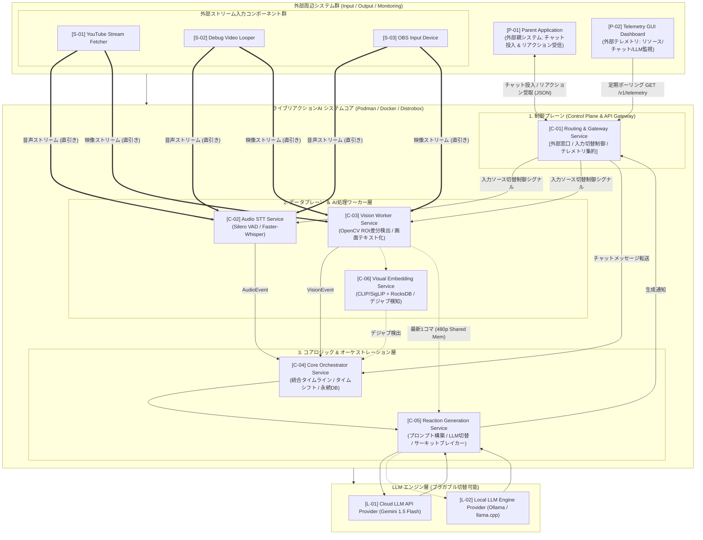
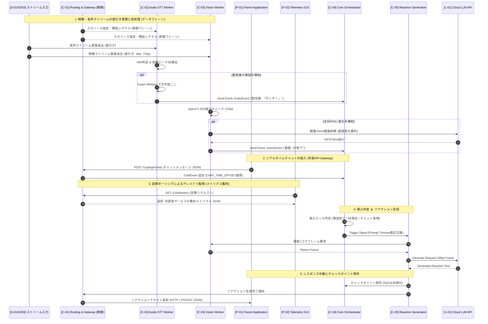

# ライブ配信リアルタイム理解・リアクション生成AI「るみぽん！」システム設計書

## 1. システム開発の経緯と前提条件

**【目的】**
YouTube等のライブ配信をリアルタイムで視聴し、配信の流れや空気感を理解した上で、一視聴者として自然なリアクションテキストを生成するAIパイプラインシステム**「るみぽん！」(Rumipon / Lumi)** を構築する。

* **本システム（姉妹システム）**: **「るみぽん！」**
  * **リポジトリ名**: **[`tk44fk40/lumi_companion`](https://github.com/tk44fk40/lumi_companion)**
  * **Lumi の名称由来**: **L**ive **U**nderstanding & **M**ultimodal **I**nteractivity Companion（ライブ映像・音声・チャットをリアルタイム理解し、配信者や視聴者に寄り添うマルチモーダルAIパートナー）
* **親システム（連携先）**: **「ゆちゃぽん！」**
  * **リポジトリ名**: **[`tk44fk40/youtube_tts`](https://github.com/tk44fk40/youtube_tts)**（YouTubeライブ配信接続 ＆ チャット音声読み上げ）

本システム「るみぽん！」は、親システム「ゆちゃぽん！」とプラグイン接続し、チャット入力の受領および生成リアクションテキストのレスポンス中継を行う姉妹システムとして稼働する。


**【前提・制約事項】**
* **API投稿の禁止**: YouTube利用規約違反やアカウントBANのリスクを回避するため、チャットへの自動投稿は行わない。
* **外部ログの供給**: 過去ログやリアルタイムのチャットメッセージは、親システム「ゆちゃぽん！」(`[P-01]`) 等からテキスト情報（タイムスタンプ付き）として供給されるものとする。

* **許容レイテンシ**: リアルタイム映像・音声の取得からリアクション生成まで、2〜4秒程度のラグは許容する。
* **ストリーム解像度・2段階最適化仕様**: 
  - **入力受領**: YouTube/テスト動画/OBSからは **最大 1080p / 60fps** まで受け付け（通常運用は **720p / 30fps**）。
  - **第1段階 (前処理 `[C-03]`)**: ワーカー側で直接 `1fps, scale=-2:720` (720p MJPEG) に間引き受領し、ROI文字・細部検出精度を100%保持。
  - **第2段階 (最終LLM投入 `[C-05]`)**: メインLLM (`[L-01]/[L-02]`) への送信時は、画面全体の雰囲気理解に特化させるためさらに **480p (640x360 程度)** に自動圧縮。API転送時間・画像トークンコストを削り最速レスポンスを実現。
* **リソース制限**: 1台のローカルPC（RTX 2070 8GB VRAM搭載）上でOBSによるゲーム配信と並行稼働させるため、AIパイプライン側のCPU/GPU/VRAM負荷を極力抑える。

### 1.1 プラットフォーム選定と段階的拡張戦略（Podman / Docker / Distrobox コンテナ基盤指針）

本システムは、高い開発速度とエコシステムの豊富さを活かして **Python** をメイン言語としてスタートするが、将来的にCPU/メモリ効率や並行処理性能の最適化を行うため、**Go言語等とのハイブリッド構成（マイクロサービス化 / IPC結合）およびコンテナ分離運用** を基本指針とする。

* **Phase 1（初期構築・Pythonモノリス）**:
  * 全コンポーネントをPython上のモジュール（`asyncio` + 内部Queue）として実装。開発速度・コード量・検証効率を最優先。
* **Phase 2（将来像・Podman / Docker / Distrobox マルチコンテナ構成）**:
  * 外部との単一接点・制御信号の調停を行う **`[C-01] Routing & Gateway Service`** を API Gateway / コントロールプレーンとして新設。
  * **制御 / データプレーン分離アーキテクチャ**: 重い映像・音声ストリームはワーカー層（`[C-02]`, `[C-03]`）が入力ソースから直接受領（直引き）し、`[C-01]` は外部プラグイン中継、入力切替制御シグナル、およびテレメトリ集約のみを担当。
  * **コンテナランタイム基盤（Podman / Docker 両対応）**: OCI標準に準拠したポータブル設計。Linux環境では **Podman (Rootless)** や **Distrobox**、Windows環境では **Docker Desktop (WSL2)** といった運用環境に応じた最適なランタイムで同一の `docker-compose.yml` / `podman-compose.yml` をそのまま稼働可能とする。
  * **Distroboxの活用**: ホストOSのNVIDIA/CUDAドライバーやデバイス（OBS仮想カメラ `/dev/video0` / Audio）と直接密結合したい前処理ワーカー（`[C-02] Audio STT Worker Service`, `[C-03] Vision Worker Service`）については、オーバーヘッドが無くホストとシームレスな **Distrobox コンテナ** を柔軟に採用・併用する。
* **Phase 3（将来像・ビジュアルメモリ ＆ 高度マルチモーダル拡張）**:
  * 超軽量画像エンコーダー（CLIP / SigLIP）と高速KVS（RocksDB）を組み合わせた **`[C-06] Visual Embedding Service`** を追加。
  * **Visual RAG（自然言語による過去シーン逆引き）**: 「ボス倒した瞬間」「インベントリ開いた場面」等のテキストから過去のコマをミリ秒即時検索。
  * **既視感（デジャブ）検出 AI コメント**: 「1時間前のボスパターンと同じだ！」といった過去シーンとの類似性をベクトル比較で自動検知してコメント化。
  * **ハイライト・総集編タイムコードの自動抽出**: チャット盛り上がりと重要シーンベクトルを組み合わせ、配信終了と同時に総集編タイムコード（`HH:MM:SS`）およびYouTube再生リンクを自動出力。
  * **【懸案対策】アーカイブタイムコード同期 ＆ RTMPラグ補正**:
    - **課題**: 途中起動時の基準点不明問題、およびOBS配信開始時刻とYouTube側のアーカイブ00:00:00到達時点との数秒のRTMPインジェスト遅延（ラグ）。
    - **対策**: 
      1. **YouTubeストリーム時**: YouTube API (`actualStartTime`) / HLS `#EXT-X-PROGRAM-DATE-TIME` タグを参照。
      2. **OBS入力時**: **OBS WebSocket API (`obs-websocket` の `StreamStateChanged` / `GetStreamStatus`)** 経由でOBSの配信経過時間を取得し、`INGEST_LATENCY_OFFSET`（RTMP伝送ラグ自動補正）を適用。
      - 上記により、どの入力ソースでもアーカイブVOD再生位置 (`HH:MM:SS`) とミリ秒精度で完全同期。
  * **【動画編集ワークフロー連携】DaVinci Resolve マーカー ＆ チャプター自動生成**:
    - **機能**: 録画中・動画ファイル直接投入時に、AIが検出した見どころ・シーン切替・会話イベントを **DaVinci Resolve 用タイムラインマーカー (`markers.csv`)**、**SRT字幕 (`.srt`)**、および **YouTube概要欄テキスト** として一括自動書き出し。
    - **スタンドアロン ＆ 超高速バッチ解析**: 外部接続なしのスタンドアロン動作（OBS録画 `GetRecordStatus` / 動画ファイル直接投入 `[S-02]`）に対応。直接動画ファイル投入時は数倍速のノーウェイト高速解析を実行し、未編集動画の下編集・テロップ入れの手間を9割削減。
  * **【LLM二段階添削 ＆ 魅力的チャプター校正 (LLM Polishing Pass)】**:
    - **固有名詞・誤字の完全補正**: `[C-02]` Whisperの一次文字起こしに対し、ゲーム画面画像と配信文脈を理解したメインLLM（Gemini等）が二段階目の添削を実施。ゲーム独自のキャラ名・魔法名・アイテム名の誤認識を100%正確な表記に自動修正。
    - **言い淀み(フィラー)除去 ＆ 魅力的なチャプター命名**: 「あー」「えーっと」などの雑音をカットして読みやすい字幕に整形し、単なるタイムスタンプを「12:45 宿敵ドラゴラム戦（第2形態）」のような魅力的でYouTube概要欄にそのまま貼れるタイトルへ自動昇華。
  * **ゼロコスト画面遷移判定**: LLMを一切叩かずにローカルでタイトル/ロード/マップ画面を0.001秒で判別し、APIコストとVRAMを節約。


---

## 2. 検討過程における技術的課題と解決アプローチ

1. **ストリーム取得・ルーティングの手法**
   - ヘッドレスブラウザやOS直キャプチャはリソース消費が激しいため却下。
   - **解決策**: `[C-01] Routing & Gateway Service` が入力制御を行い、ワーカーコンテナ（`[C-02]`, `[C-03]`）が `[S-03] OBS Input Device` (`/dev/video0`)、`[S-01] YouTube Stream Fetcher`、`[S-02] Debug Video Looper` からの映像・音声を直接引き込んで受領（直引き構成）。
2. **LLM推論遅延によるラグの累積**
   - 映像フレームを逐次処理すると、LLMの推論待ち（1〜3秒）の間にバッファが溜まり、過去の映像に反応してしまう。
   - **解決策**: `Queue(maxsize=1)` によるプロデューサー・コンシューマーパターンを適用し、古いフレームを自動破棄して「常に最新の1コマ」だけをLLMに渡す設計とした。
3. **ステートレスなLLMへの「文脈」の維持**
   - メインマルチモーダルLLMはトークン節約のため最新1コマのみを評価する。長時間の配信では過去の経緯をテキスト化して保持することが不可欠。
   - **解決策**: 音声（発言・環境音）、画面（ROI変化イベント）、チャットをテキスト化して統合タイムラインを作り、バックグラウンドで3〜5分周期で「ローリング要約」を実行。常に「最新の長期文脈バッファ」をPythonメモリ上に保持する。
4. **音声・映像イベントのテキスト化とトリガー検知**
   - **音声イベント**: `Silero VAD` + `Faster-Whisper` (int8/fp16量子化) で配信者の声区間を文字起こしすると共に、**音響ピーク・SE検知（銃声、爆発、悲鳴、大音量変化等）** も検出してイベント化。
   - **映像イベント**: OpenCVで特定の **ROI（HPバー、インベントリ、キルログ等）** の差分（SSIM / カラーヒストグラム / 数値変化）を監視し、重要変化があった時のみ軽量Vision LLM（クラウドAPI `[L-01]` またはローカル軽量LLM `[L-02]`）でテキスト化。
5. **マルチソース間のタイムラグ・同期問題**
   - 映像・音声・チャット間で発生する伝送遅延（特にYouTube APIチャットの数秒〜十数秒の遅延）によるタイムスタンプのズレ。
   - **解決策**: 各イベントに受信時/発生時の **共通タイムスタンプ (Unix Timestamp)** を付与し、設定可能な **タイムシフト（`CHAT_TIME_OFFSET`）** とスライディングウィンドウによるアライメント制御を導入。
6. **LLMプロバイダー（クラウド ⇔ ローカル）のプラガブル切替**
   - **解決策**: メインのリアクション生成および軽量Vision LLMについて、外部クラウドAPI（`[L-01]` Gemini 1.5 Flash等）とローカル軽量LLMエンジン（`[L-02]` Ollama / llama.cpp）を環境変数等で自由に切替（マルチLLMプロバイダー抽象化）できる構成とした。

### 2.1 堅牢性・効率化のための 9大制御メカニズム

運用時の安定性と低リソース消費を担保するため、以下のメカニズムを本設計に組み込む。

* **① 制御 / データプレーン分離 (Control/Data Plane Separation)**:
  大容量映像・音声ストリーム（データプレーン）はワーカーコンテナ（`[C-02]`, `[C-03]`）が入力ソースから直接受領し、`[C-01]` は外部API Gateway、入力切替シグナル、およびテキストルーティング（制御プレーン）に専念してCPU/メモリ負荷を最小化。
* **② 2段階解像度最適化（Dual-Stage Resolution Optimization）**:
  前処理 `[C-03]` は UI・文字識別精度のために **720p (1fps)** を使用し、最終LLM投入 `[C-05]` 段階では雰囲気に特化して **480p (640x360 程度)** へ再リサイズ。通信遅延と画像トークンコストを最小化。
* **③ 動的タイムシフト自動キャリブレーション（Dynamic Time-Shift Calibration）**:
  配信者の発言時刻（`[C-02]`）とチャット急増キーワードの差分から、`CHAT_TIME_OFFSET` をバックグラウンドで動的自動微調整。
* **④ プロンプト優先度トリミング（Prompt Trimmer）**:
  チャット急増時のトークンスパイクを防ぐため、プロンプト構築時に高優先度イベント（発言/主要画面変化）を自動選別してコンテキストを最適軽量化。
* **⑤ 文脈状態のローカルSQLite永続化（Context Checkpoint Recovery）**:
  `[C-04]` のメモリ文脈をローカル SQLite (WALモード) に定期チェックポイント保存し、コンテナ再起動時も瞬時に文脈を復元。
* **⑥ サーキットブレイカー ＆ 指数バックオフ（Circuit Breaker & Backoff）**:
  APIレート制限（429エラー）検知時に自動で指数バックオフを行い、障害時は `[L-02]` ローカルLLMへ安全にフォールバック。
* **⑦ テレメトリGUIの「定期ポーリング化」（Polling API）**:
  ブロードキャスト処理の常時負荷を排除し、`[P-02]` テレメトリGUI側からの定期ポーリング（`GET /v1/telemetry`）に応答する非同期HTTP REST方式を採用。
* **⑧ アーカイブタイムコード同期 ＆ RTMPラグ自動補正（Archive Timecode & Ingest Sync）**:
  YouTube API (`actualStartTime`) / HLSタグの参照、および **OBS WebSocket API (`obs-websocket` の `GetStreamStatus`)** によるOBS配信時間の直接取得 ＋ `INGEST_LATENCY_OFFSET`（伝送ラグ自動補正）により、切り抜き用タイムコード（`HH:MM:SS`）をアーカイブVODの再生位置とミリ秒精度で完全同期。
* **⑨ メインLLM二段階字幕添削 ＆ チャプター自動校正（LLM Polishing Pass）**:
  `[C-02]` Whisperの文字起こしや一次チャプター候補に対し、ゲーム画面と全体文脈を把握しているメインLLM（Gemini等）が添削・校正を実施。ゲーム固有キャラ名/アイテム名の誤認識補正、言い淀み（フィラー）カット、および魅力的なチャプタータイトル命名を一括適用。


---

## 3. 最終的な構成・システムアーキテクチャ

### 3.1 周辺システム構成イメージ（Mermaidアーキテクチャ図）



### 3.2 プラグイン＆ストリーム連携 シーケンス図



---

## 4. パイプライン詳細設計 ＆ コンポーネント仕様

### (1) 正式コンポーネント一覧と役割

| コンポーネントID | コンポーネント正式名称 | 推奨ランタイム | 役割・責務 |
| :--- | :--- | :--- | :--- |
| **`[C-01]`** | **Routing & Gateway Service** | Podman / Docker | **【制御プレーン】** 外部唯一窓口(API Gateway)、入力切替指示、プラグイン中継、全メトリクス集約ポーリングAPI |
| **`[C-02]`** | **Audio STT Worker Service** | Podman / Docker / **Distrobox** | **【データプレーン】** 音声直接受領(直引き)、VAD、Faster-Whisper文字起こし、SE検出 |
| **`[C-03]`** | **Vision Worker Service** | Podman / Docker / **Distrobox** | **【データプレーン】** 映像直接受領(直引き 720p)、最新コマ保持(`maxsize=1`)、OpenCV ROI監視 |
| **`[C-04]`** | **Core Orchestrator Service** | Podman / Docker | 統合タイムライン管理、`CHAT_TIME_OFFSET` 動的アライメント、SQLite永続化、発火制御 |
| **`[C-05]`** | **Reaction Generation Service** | Podman / Docker | 統合プロンプト構築 (Prompt Trimmer)、`[L-01]/[L-02]` 切替、480p画像リサイズ |
| **`[C-06]`** | **Visual Embedding Service** | Podman / Docker / **Distrobox** | **(Phase 3拡張)** CLIP/SigLIPによる画像特徴量抽出、RocksDBへの高速KVS蓄積、Visual RAG・デジャブ検知 |
| **`[S-01]`** | **YouTube Stream Fetcher** | Podman / Docker | YouTubeライブHLS取得・FFmpegストリーム送出 |
| **`[S-02]`** | **Debug Video Looper** | Podman / Docker / Distrobox | テスト動画の無限ループ再生ストリーミング (`-stream_loop -1`) |
| **`[S-03]`** | **OBS Input Device** | ホスト / Distrobox | OBS仮想カメラ (`/dev/video0`) / マイク音声デバイス |
| **`[P-01]`** | **Parent Application** | 外部システム | **親システム「ゆちゃぽん！」(Yuchapon)**: チャット過去ログ・リアルタイム入力の供給、生成リアクションの受取 |

| **`[P-02]`** | **Telemetry GUI Dashboard** | 外部システム | **定期ポーリング (`GET /v1/telemetry`)** によるシステム状態・LLM利用量のGUI表示 |
| **`[L-01]`** | **Cloud LLM API Provider** | クラウドAPI | Gemini 1.5 Flash 等の高速マルチモーダルLLM API |
| **`[L-02]`** | **Local LLM Engine Provider** | ローカルコンテナ/ホスト | Ollama / llama.cpp 等による超軽量ローカルLLM / Vision LLM 推論エンジン |

---

### (2) ローカルLLMプラットフォーム (`[L-02]`) の選定と制約対策

本システムは **RTX 2070 (VRAM 8GB)** 1台でOBSゲーム配信と並行稼働させるため、ローカルLLMを使用する場合の利用可能なVRAM上限は **約 1.5GB 〜 2.5GB** と極めて制限されます。この制約下で動作する推奨プラットフォームおよび軽量モデルの構成指針を定めます。

#### 1. 推奨ローカルLLMプラットフォーム

* **Ollama (推奨)**:
  * Docker / Podman コンテナ化およびDistroboxでの運用が最も容易。REST API (`http://localhost:11434/api/generate`) を標準提供し、`[C-05]` からのプラガブルな呼び出しに最適。
* **llama.cpp / llama-cpp-python**:
  * GGUF量子化モデル（`Q4_K_M`, `IQ3_XS` 等）に特化し、VRAM消費をミリ単位で制御可能。CPUメイン＋VRAMオフロード設定に対応。

#### 2. 推奨超軽量モデル選定（VRAM < 2.5GB 制限対応）

| 用途 | 推奨モデル | パラメータ数 | VRAM/RAM消費目安 | 特徴・役割 |
| :--- | :--- | :--- | :--- | :--- |
| **軽量Vision LLM** | **Moondream2** (`vikhyatk/moondream2`) | 1.8B | **VRAM 約1.8GB** | 超軽量マルチモーダル。画面ROI変化時の「何が起きたか」の1文要約に最適。 |
| **ローカルテキストLLM** | **Qwen2.5-0.5B-Instruct** | 0.5B | **VRAM 約0.6GB** | 極小テキストモデル。API障害時のフォールバックや簡潔なリアクション生成に流用。 |
| **ローカルテキストLLM** | **Qwen2.5-1.5B-Instruct** (Q4_K_M) | 1.5B | **VRAM 約1.2GB** | 8bit/4bit量子化により超軽量動作。簡単な日本語リアクション生成が可能。 |

---

### (3) 外部テレメトリ GUI (`[P-02]`) 定期ポーリング API 仕様

`[P-02] Telemetry GUI Dashboard` は、定期インターバル（例: 1秒〜2秒毎）で `[C-01] Routing & Gateway Service` の `GET /v1/telemetry` 端点を叩き、以下の JSON メッセージを受信してダッシュボードに反映する。

#### テレメトリ API レスポンス JSON スキーマ例 (`GET /v1/telemetry`)
```json
{
  "event_type": "system_telemetry",
  "timestamp": 1785505010.500,
  "system_status": {
    "uptime_seconds": 3600,
    "status": "active_running",
    "active_input_source": "[S-01] YouTubeStreamFetcher"
  },
  "resource_usage": {
    "cpu_percent": 15.2,
    "ram_used_mb": 1420,
    "gpu_vram_used_mb": 2350,
    "gpu_utilization_percent": 22.0
  },
  "chat_stream": {
    "chat_rate_per_min": 45,
    "last_chat": {"user": "視聴者A", "message": "神プレイ！"}
  },
  "reaction_output": {
    "last_generated_text": "今のエイムすごすぎる！",
    "generated_at": 1785505008.120,
    "latency_ms": 1850,
    "provider_used": "[L-01] Cloud LLM API Provider (Gemini 1.5 Flash)"
  },
  "llm_usage": {
    "primary_provider": "[L-01] Gemini 1.5 Flash",
    "fallback_provider": "[L-02] Local Ollama (Moondream2 / Qwen2.5)",
    "circuit_breaker_status": "CLOSED (Normal)",
    "total_prompt_tokens": 125000,
    "total_completion_tokens": 8400,
    "estimated_cost_usd": 0.012,
    "quota_remaining_percent": 98.5
  }
}
```

---

## 5. デバッグ・運用環境設定

### (1) Podman / Docker ポータブルマルチコンテナ構成例 (`docker-compose.yml` / `podman-compose.yml`)

`[L-01]` (クラウドAPI) および `[L-02]` (ローカルOllamaコンテナ) を並行配置した構成例。

```yaml
version: '3.8'

services:
  # [C-01] ルーティング & ゲートウェイ サービス (制御プレーン / API Gateway)
  routing-gateway:
    build: ./services/routing_gateway
    ports:
      - "8080:8080" # [P-01] 親システム & [P-02] テレメトリGUI用(ポーリングAPI)
    environment:
      - CORE_SERVICE_URL=http://core-orchestrator:8081

  # [C-04] コアオーケストレーター
  core-orchestrator:
    build: ./services/core
    environment:
      - AUDIO_SERVICE_URL=http://audio-stt-service:5000
      - VISION_SERVICE_URL=http://vision-service:5001
      - CHAT_TIME_OFFSET=-5.0
      - SQLITE_DB_PATH=/data/context_state.db
    volumes:
      - ./data:/data

  # [C-02] 音声テキスト化サービス (データプレーン: 音声直引き)
  audio-stt-service:
    build: ./services/audio_stt
    devices:
      - "nvidia.com/gpu=all"
    ports:
      - "5000:5000"

  # [C-03] 画面監視サービス (データプレーン: 映像直引き 720p)
  vision-service:
    build: ./services/vision
    environment:
      - INPUT_SOURCE_TYPE=file
      - TEST_VIDEO_PATH=/data/test_video.mp4
    volumes:
      - ./debug_data/test_video.mp4:/data/test_video.mp4:ro
    devices:
      - "/dev/video0:/dev/video0"

  # [C-05] リアクション生成サービス
  reaction-generator:
    build: ./services/reaction_gen
    environment:
      - LLM_PROVIDER_MODE=cloud # "cloud" or "local" or "auto_fallback"
      - GEMINI_API_KEY=${GEMINI_API_KEY}
      - LOCAL_OLLAMA_URL=http://local-llm-engine:11434

  # [L-02] ローカルLLMエンジン (Ollama コンテナ)
  local-llm-engine:
    image: ollama/ollama:latest
    ports:
      - "11434:11434"
    devices:
      - "nvidia.com/gpu=all"
    volumes:
      - ./ollama_models:/root/.ollama

  # [S-02] デバッグ用動画リピート配信コンポーネント
  debug-video-looper:
    build: ./tools/debug_looper
    environment:
      - TEST_VIDEO_PATH=/data/test_video.mp4
      - ROUTER_URL=http://routing-gateway:8080/stream/video
    volumes:
      - ./debug_data/test_video.mp4:/data/test_video.mp4:ro
```

---

### (2) Distrobox を活用した開発・デバッグ環境設定

ホストOSのNVIDIAドライバーやGPU/PipeAudio/デバイス（`/dev/video0`）とオーバーヘッド無く直接結合したいワーカーコンテナ（`[C-02] Audio STT Worker Service`, `[C-03] Vision Worker Service`）については、**Distrobox コンテナ** を採用することで設定の平易化と高速開発を実現する。

#### Distrobox コンテナの作成・実行例
```bash
# NVIDIA GPUおよびホストデバイスをフルパススルーした開発用Distroboxコンテナを作成
distrobox create --name ai-pipeline-dev --image archlinux:latest --nvidia

# コンテナに入ってFaster-Whisper / OpenCV環境をセットアップ
distrobox enter ai-pipeline-dev

# コンテナ内でVision Worker [C-03] を直接実行（ホストのOBS仮想カメラやCUDAがそのまま認識される）
python3 services/vision/main.py
```
