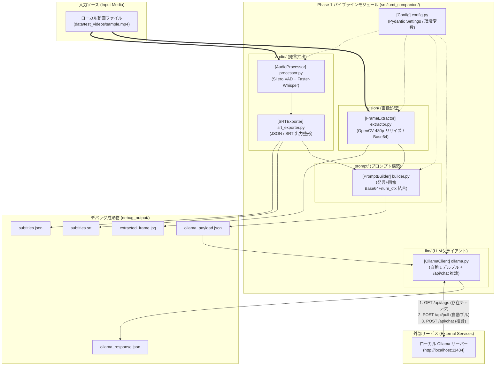
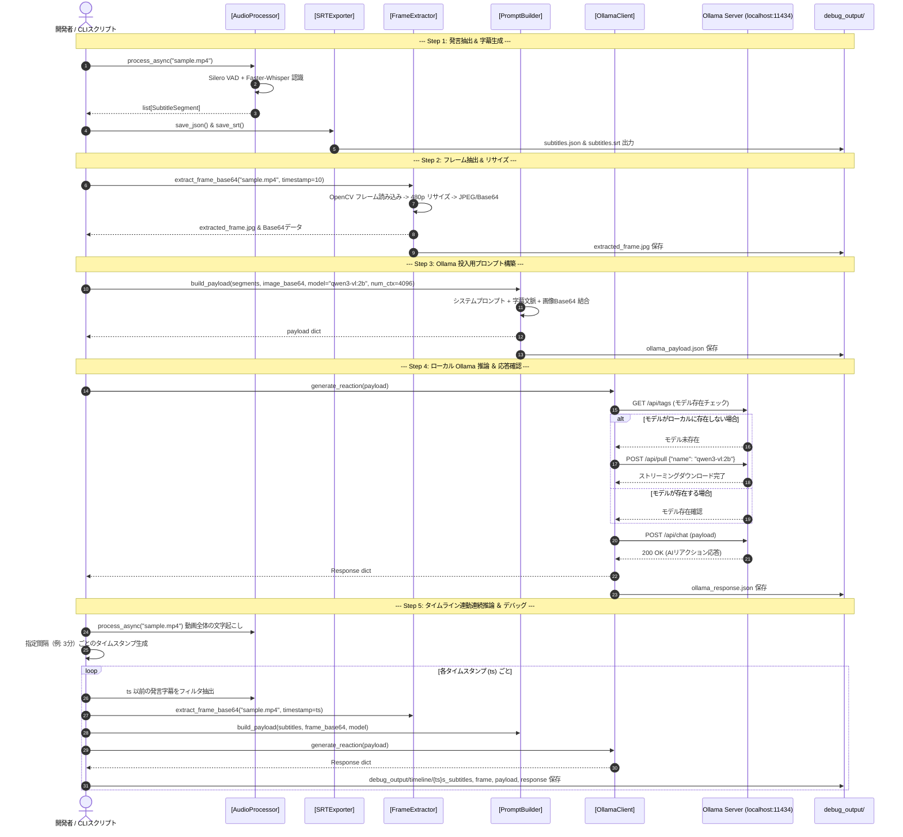

# Phase 1 開発計画 ＆ デバッグ手順書 (Phase 1 Development & Debugging Guide)

本ドキュメントは、「るみぽん！」(Lumi Companion) の Phase 1 初期構築における開発環境セットアップ、技術仕様、コンポーネント構成、シーケンス図、および Step 1 〜 Step 5 の段階的デバッグ実行手順を記載した開発者ガイドです。

---

## 1. システム構成図 ＆ シーケンス図 (Architecture Diagrams)

### 1.1 コンポーネント構成図 (Component Diagram)



---

### 1.2 処理シーケンス図 (Sequence Diagram)



---

## 2. 外部システム前提条件 (Prerequisites)

本システムの動作には、以下の外部ツールが事前導入・稼働している必要があります。

- **`FFmpeg`**: システムにインストール済みであること（`ffmpeg -version` が実行可能）。動画からの音声トラック分離・下処理に使用します。
- **`Ollama`**: ローカル環境で推論サーバーが稼働中であること（`http://localhost:11434` にて `ollama serve` または Ollama サービスが実行中）。

---

## 3. 開発環境のセットアップ (`uv`)

### 推奨 Python バージョン
- **Python 3.12**（`.python-version` により指定）
- `faster-whisper` (CTranslate2), `torch`, `onnxruntime`, `opencv-python` 等の C拡張パッケージのビルド済みホイールが最も安定して動作します。

### 開発用依存パッケージ (`uv add --dev`)
型チェックツールやフォーマッター等の開発用ツールは、プロジェクトの開発依存関係 (`dev`) として管理します。
```bash
uv add --dev basedpyright ruff pytest-cov pre-commit
```

### プロジェクト依存パッケージの同期
```bash
uv python pin 3.12
uv sync
# または requirements.txt からのインストール:
uv pip install -r requirements.txt
```

---

## 4. RTX 2070 (8GB VRAM) 環境でのテスト用推奨モデル・プロバイダー

Phase 1 単体デバッグ・テストでは、ローカル Ollama モデルおよびクラウド Gemini API の両方をサポートし、柔軟に切替可能です。

### A. ローカル Ollama モデル (`qwen3-vl:2b`)
- **VRAM消費量**: 約 2.0 ~ 4.0 GB（コンテキスト長や処理画像による）
- **特長**: 完全ローカル動作、優れた日本語表現力・画面文字（OCR）認識能力。
- **自動モデルプル**: 対象モデルが Ollama 上に未ダウンロードの場合、プログラムが Ollama API (`POST /api/pull`) 経由で自動取得。
- **コンテキスト長**: APIリクエスト時に `options.num_ctx: 4096` を動的指定。

### B. クラウド Gemini API (`gemini-2.0-flash`)
- **VRAM消費量**: 0 GB（ローカル VRAM 非使用。`qwen3-vl:2b` の VRAM 負荷回避策として推奨）
- **特長**: 超高速・高精度の Vision / テキスト処理能力。
- **設定方法**: 環境変数 `GEMINI_API_KEY` を設定することで利用可能。

---

## 5. Step 1 〜 Step 5 段階的デバッグ実行手順

成果物はすべて `debug_output/` 配下に出力・保存されます。

### Step 1: 発言抽出（音声認識）＆ 字幕生成
- **実行コマンド**:
  ```bash
  uv run python scripts/debug_step1_audio.py --video sample.mp4
  ```
- **生成成果物**:
  - `debug_output/subtitles.json`: タイムスタンプ付き発言抽出データ
  - `debug_output/subtitles.srt`: 標準 SRT 字幕ファイル

### Step 2: フレーム抽出 ＆ リサイズ (480p)
- **実行コマンド**:
  ```bash
  uv run python scripts/debug_step2_vision.py --video sample.mp4 --timestamp 10
  ```
- **生成成果物**:
  - `debug_output/extracted_frame.jpg`: 指定秒（例: 10秒目）のリサイズ済み画像（480p相当）

### Step 3: LLM投入用プロンプトJSONの生成
- **実行コマンド**:
  ```bash
  # Ollama (qwen3-vl:2b) 用
  uv run python scripts/debug_step3_prompt.py --model qwen3-vl:2b --num-ctx 4096

  # Gemini API (gemini-2.0-flash) 用
  uv run python scripts/debug_step3_prompt.py --provider gemini --model gemini-2.0-flash
  ```
- **生成成果物**:
  - `debug_output/ollama_payload.json` (または `llm_payload.json`): 発言コンテキスト＋画像Base64＋プロンプト＋設定パラメータを含むLLM API互換ペイロード

### Step 4: LLMリクエスト ＆ 応答確認
- **実行コマンド**:
  ```bash
  # Ollama (qwen3-vl:2b)
  uv run python scripts/debug_step4_ollama.py --model qwen3-vl:2b

  # Gemini API (gemini-2.0-flash)
  uv run python scripts/debug_step4_ollama.py --provider gemini --model gemini-2.0-flash
  ```
- **生成成果物**:
  - `debug_output/ollama_response.json`: LLM から返却されたAIコメント・リアクション応答JSON

### Step 5: タイムライン検証デバッグ（時系列連続推論シミュレーション）
動画全体の音声認識結果をもとに、一定間隔（デフォルト: 180秒＝3分ごと）および動画末尾のタイムスタンプにおける「その時点までの発言文脈」と「その時点の画面フレーム」を抽出し、連続で LLM に推論リクエストを送信することで、配信の流れに応じた応答の変化を総合検証します。

- **実行コマンド**:
  ```bash
  uv run python scripts/debug_step5_timeline.py --video sample.mp4 --interval 180
  ```
- **生成成果物** (`debug_output/timeline/`):
  - `debug_output/timeline/{timestamp}s_subtitles.json`: そのタイムスタンプまでに抽出された発言文脈リスト
  - `debug_output/timeline/{timestamp}s_frame.jpg`: そのタイムスタンプ時点のリサイズ済み画像
  - `debug_output/timeline/{timestamp}s_payload.json`: LLM への投入ペイロード JSON
  - `debug_output/timeline/{timestamp}s_response.json`: LLM からの AI リアクション応答生データ JSON
